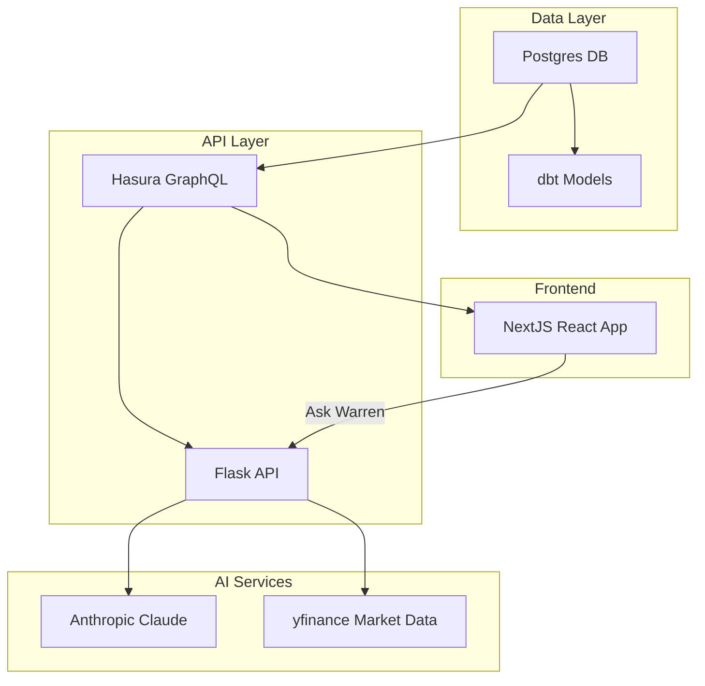

<div align="center">

# Data Engineering with Python

### From Fundamentals to Full-Stack Trading Platforms

[](https://python.org)
[](https://jupyter.org)
[](LICENSE)
[](https://github.com/mhdk1602/python_training/commits/main)
[](https://github.com/mhdk1602/python_training/stargazers)

---

**34 hands-on notebooks** | **5 learning tracks** | **1 production-grade trading platform**

A practice-first curriculum that teaches Python, data engineering, backend APIs, frontend development, GenAI, and quantitative finance by building a real stock trading application from scratch.

[Get Started](#-quick-start) | [Syllabus](#-learning-roadmap) | [Architecture](#-platform-architecture) | [Contributing](#-contributing)

</div>

---

## What You Will Learn

| Track | Skills | Chapters |
|:------|:-------|:---------|
| **Python & Data Engineering** | Pandas, NumPy, Dask, data modeling, schema design, ETL pipelines | 0 -- 5 |
| **Backend & APIs** | Flask, REST, GraphQL, Postgres, Hasura, Docker | 3, 6 |
| **Frontend & UI** | NextJS, React, Apollo Client, Tailwind CSS | 6 |
| **GenAI & LLMs** | Anthropic Claude, LangChain, embeddings, vector search, Elasticsearch | 7 -- 8 |
| **Trading & Finance** | Portfolio management, market data (yfinance), news sentiment, AI-driven analysis | 6, 8 |

---

## Quick Start

### Prerequisites

- Python 3.10+
- Docker & Docker Compose
- Node.js 18+ (for the NextJS frontend)
- Git

### Setup

```bash
# Clone the repository
git clone https://github.com/mhdk1602/python_training.git
cd python_training

# Launch the full trading platform stack
docker compose up -d

# Services available after startup:
#   Postgres        -> localhost:5437
#   Hasura Console  -> localhost:8080
#   NextJS App      -> localhost:3000
#   Flask API       -> localhost:5002
```

### Running Notebooks

```bash
# Install Jupyter (if not already available)
pip install jupyter

# Start Jupyter from the repo root
jupyter notebook
```

Open any notebook from the syllabus below. Chapters 0-5 and 7-9 are self-contained. Chapter 6 requires Docker services to be running.

---

## Platform Architecture

The curriculum builds toward a full-stack stock trading platform. Each chapter teaches the concepts that power a piece of this system.



---

## Learning Roadmap

Each chapter builds on the previous. Difficulty and estimated time are noted to help you plan your learning.

<details>
<summary><b>Chapter 0: Fundamentals</b>&nbsp;&nbsp;<code>Beginner</code>&nbsp;&nbsp;<code>~4 hours</code></summary>

<br>

Your starting point. Git, Python basics, Jupyter, and core programming patterns.

| # | Topic | Notebook |
|---|-------|----------|
| 0.0 | Introduction to GitHub | [0. Git Fundamentals.ipynb](notebooks/00-fundamentals/0.%20Git%20Fundamentals.ipynb) |
| 0.1 | Getting Started with Python | [0.1 Getting Started - Python.ipynb](notebooks/00-fundamentals/0.1%20Getting%20Started%20-%20Python.ipynb) |
| 0.2 | Jupyter Notebooks | [0.2 Jupyter - Intro.ipynb](notebooks/00-fundamentals/0.2%20Jupyter%20-%20Intro.ipynb) |
| 0.3 | Functions | [0.3 Functions.ipynb](notebooks/00-fundamentals/0.3%20Functions.ipynb) |
| 0.4 | Looping | [0.4 Looping.ipynb](notebooks/00-fundamentals/0.4%20Looping.ipynb) |
| 0.5 | Reading Data | [0.5 Reading-Data.ipynb](notebooks/00-fundamentals/0.5%20Reading-Data.ipynb) |

</details>

<details>
<summary><b>Chapter 1: Introduction to Data Engineering</b>&nbsp;&nbsp;<code>Beginner</code>&nbsp;&nbsp;<code>~3 hours</code></summary>

<br>

What data engineering is, the terminology you need, and the data formats you will encounter daily.

| # | Topic | Notebook |
|---|-------|----------|
| 1.1 | Overview & Role in the Data Pipeline | [1.1 Fundamentals.ipynb](notebooks/01-intro-data-engineering/1.1%20Fundamentals.ipynb) |
| 1.2 | Key Concepts & Terminology | [1.2 Key concepts and terminology.ipynb](notebooks/01-intro-data-engineering/1.2%20Key%20concepts%20and%20terminology.ipynb) |
| 1.3 | Common Data Formats & Structures | [1.3 Data Formats & Structures.ipynb](notebooks/01-intro-data-engineering/1.3%20Data%20Formats%20%26%20Structures.ipynb) |

</details>

<details>
<summary><b>Chapter 2: Data Modeling & Schema Design</b>&nbsp;&nbsp;<code>Intermediate</code>&nbsp;&nbsp;<code>~5 hours</code></summary>

<br>

Relational and NoSQL modeling patterns. You will design schemas for the trading platform's data layer.

| # | Topic | Notebook |
|---|-------|----------|
| 2.1 | Data Modeling Introduction | [2.1 Data Modeling.ipynb](notebooks/02-data-modeling/2.1%20Data%20Modeling.ipynb) |
| 2.2 | NoSQL Databases | [2.2 NoSQL DB.ipynb](notebooks/02-data-modeling/2.2%20NoSQL%20DB.ipynb) |
| 2.3 | Schema Modeling | [2.3 Schema Modeling.ipynb](notebooks/02-data-modeling/2.3%20Schema%20Modeling.ipynb) |
| 2.4 | Data Modeling Exercise | [2.4 Data Modeling - Exercise.ipynb](notebooks/02-data-modeling/2.4%20Data%20Modeling%20-%20Exercise.ipynb) |

</details>

<details>
<summary><b>Chapter 3: Data Storage & Retrieval</b>&nbsp;&nbsp;<code>Intermediate</code>&nbsp;&nbsp;<code>~3 hours</code></summary>

<br>

File systems, databases, data lakes. Reading and writing CSV, JSON, Parquet in Python.

| # | Topic | Notebook |
|---|-------|----------|
| 3 | Storage Systems & Best Practices | [3. Data Storage and Retrieval.ipynb](notebooks/03-data-storage/3.%20Data%20Storage%20and%20Retrieval.ipynb) |

</details>

<details>
<summary><b>Chapter 4: Data Processing & Transformation</b>&nbsp;&nbsp;<code>Intermediate</code>&nbsp;&nbsp;<code>~5 hours</code></summary>

<br>

Data cleaning, filtering, aggregation. Hands-on with Pandas, NumPy, and Dask for scalable pipelines.

| # | Topic | Notebook |
|---|-------|----------|
| 4 | Processing & Transformation | [4. Data Processing and Transformation.ipynb](notebooks/04-data-processing/4.%20Data%20Processing%20and%20Transformation.ipynb) |

</details>

<details>
<summary><b>Chapter 5: Data Streaming & Real-time Processing</b>&nbsp;&nbsp;<code>Advanced</code>&nbsp;&nbsp;<code>~4 hours</code></summary>

<br>

Apache Kafka, Apache Flink, Faust. Building real-time data processing pipelines in Python.

| # | Topic | Notebook |
|---|-------|----------|
| 5 | Streaming & Real-time Pipelines | [5. Data Streaming and Real-time Processing.ipynb](notebooks/05-data-streaming/5.%20Data%20Streaming%20and%20Real-time%20Processing.ipynb) |

</details>

<details>
<summary><b>Chapter 6: Data Integration, APIs & Frontend</b>&nbsp;&nbsp;<code>Advanced</code>&nbsp;&nbsp;<code>~10 hours</code></summary>

<br>

The largest chapter. Build the full trading platform: REST APIs, GraphQL with Hasura, a NextJS frontend, and an AI chatbot.

| # | Topic | Notebook |
|---|-------|----------|
| 6.1 | Data Integration with APIs | [6.1 Data Integrations with APIs.ipynb](notebooks/06-apis-and-frontend/6.1%20Data%20Integrations%20with%20APIs.ipynb) |
| 6.2 | APIs (continued) | [6.2 Data Integrations with APIs - contd.ipynb](notebooks/06-apis-and-frontend/6.2%20Data%20Integrations%20with%20APIs%20-%20contd.ipynb) |
| 6.3 | Introduction to GraphQL | [6.3 GraphQL.ipynb](notebooks/06-apis-and-frontend/6.3%20GraphQL.ipynb) |
| 6.4.1 | Postgres & Postgraphile Setup | [6.4.1 Postgres Postgraphile setup.ipynb](notebooks/06-apis-and-frontend/6.4.1%20Postgres%20Postgraphile%20setup.ipynb) |
| 6.4.2 | NextJS Implementation | [6.4.2 NextJS Implementation.ipynb](notebooks/06-apis-and-frontend/6.4.2%20NextJS%20Implementation.ipynb) |
| 6.5 | Migration to Hasura | [6.5 Hasura - GraphQL.ipynb](notebooks/06-apis-and-frontend/6.5%20Hasura%20-%20GraphQL.ipynb) |
| 6.6 | Frontend Chatbot App | [6.6 Frontend Chatbot App.ipynb](notebooks/06-apis-and-frontend/6.6%20Frontend%20Chatbot%20App.ipynb) |

> **Note**: Section 6.6 is best completed after Chapter 7 (Text Comparison & Embeddings).

**Sub-projects built in this chapter:**
- `react-app/` -- NextJS stock trading dashboard with Apollo Client and Tailwind CSS
- `flask-app/` -- Flask API serving market data, news, and the "Ask Warren" AI chatbot
- `postgres/` -- Database initialization scripts
- `GraphQL Server/` -- Standalone Node.js GraphQL server

</details>

<details>
<summary><b>Chapter 7: Text Comparison & Embeddings</b>&nbsp;&nbsp;<code>Advanced</code>&nbsp;&nbsp;<code>~6 hours</code></summary>

<br>

Fuzzy matching, Levenshtein distance, TF-IDF, vector embeddings, and Elasticsearch integration.

| # | Topic | Notebook |
|---|-------|----------|
| 7.0 | Text Comparison Algorithms | [7. Text Comparison.ipynb](notebooks/07-text-and-embeddings/7.%20Text%20Comparison.ipynb) |
| 7.1 | Text Embeddings | [7.1 Embeddings.ipynb](notebooks/07-text-and-embeddings/7.1%20Embeddings.ipynb) |
| 7.2 | Embeddings in Data Engineering | [7.2 Embeddings - Contd.ipynb](notebooks/07-text-and-embeddings/7.2%20Embeddings%20-%20Contd.ipynb) |
| 7.3 | Embeddings with Elasticsearch | [7.3 Embeddings - Elasticsearch.ipynb](notebooks/07-text-and-embeddings/7.3%20Embeddings%20-%20Elasticsearch.ipynb) |

</details>

<details>
<summary><b>Chapter 8: Generative AI & LLMs</b>&nbsp;&nbsp;<code>Advanced</code>&nbsp;&nbsp;<code>~6 hours</code></summary>

<br>

From GPT-4 fundamentals to building an Anthropic-powered chatbot with LangChain.

| # | Topic | Notebook |
|---|-------|----------|
| 8.0 | GPT-4 Primer | [Chatbot - GPT4- Primer.docx](notebooks/08-genai-llms/GPT4-Chatbot/Chatbot%20-%20GPT4-%20Primer.docx) |
| 8.2 | Anthropic Setup | [8.2 Anthropic setup.ipynb](notebooks/08-genai-llms/8.2%20Anthropic%20setup.ipynb) |
| 8.3 | Anthropic Chatbot Playbook | [8.3 Chatbot - Anthropic - Playbook.ipynb](notebooks/08-genai-llms/8.3%20Chatbot%20-%20Anthropic%20-%20Playbook.ipynb) |
| 8.4 | LangChain | [8.4 Langchain.ipynb](notebooks/08-genai-llms/8.4%20Langchain.ipynb) |

</details>

<details>
<summary><b>Chapter 9: Data Quality & Validation</b>&nbsp;&nbsp;<code>Intermediate</code>&nbsp;&nbsp;<code>~4 hours</code></summary>

<br>

Validation frameworks and implementing data quality checks with dbt.

| # | Topic | Notebook |
|---|-------|----------|
| 9.1 | Importance, Techniques & Frameworks | [9.1 Data Quality and Validation.ipynb](notebooks/09-data-quality/9.1%20Data%20Quality%20and%20Validation.ipynb) |
| 9.2 | Data Quality with dbt | [9.2 DQ - Dbt.ipynb](notebooks/09-data-quality/9.2%20DQ%20-%20Dbt.ipynb) |

**Sub-project:** `dbt/dbt_dq/` -- dbt project with NYC taxi data models and custom quality tests.

</details>

---

## Tech Stack

<div align="center">

| Category | Technologies |
|:---------|:-------------|
| **Languages** | Python, TypeScript, JavaScript, SQL |
| **Data** | Pandas, NumPy, Dask, dbt |
| **Databases** | PostgreSQL, Elasticsearch |
| **APIs** | Flask, GraphQL, Hasura, Postgraphile |
| **Frontend** | Next.js 14, React 18, Apollo Client, Tailwind CSS |
| **AI/ML** | Anthropic Claude, LangChain, TF-IDF, Vector Embeddings |
| **Infrastructure** | Docker, Docker Compose, GitHub Actions |
| **Finance** | yfinance, News Sentiment Analysis |

</div>

---

## Repository Structure

```
python_training/
  notebooks/
    00-fundamentals/          # Git, Python basics, Jupyter, loops, I/O
    01-intro-data-engineering/ # Data engineering overview & terminology
    02-data-modeling/          # Relational & NoSQL schema design
    03-data-storage/           # Storage systems, CSV/JSON/Parquet
    04-data-processing/        # Pandas, NumPy, Dask pipelines
    05-data-streaming/         # Kafka, Flink, real-time processing
    06-apis-and-frontend/      # REST, GraphQL, NextJS, chatbot
    07-text-and-embeddings/    # Fuzzy matching, TF-IDF, Elasticsearch
    08-genai-llms/             # GPT-4, Anthropic, LangChain
    09-data-quality/           # Validation frameworks, dbt
    bonus/                     # Advent of Code, extra exercises
  data/
    input_files/               # Sample datasets for exercises
    output_files/              # Generated charts and outputs
    embeddings/                # TF-IDF matrices, vector DBs
    qa/                        # Anthropic-generated Q&A datasets
  react-app/                   # NextJS stock trading dashboard
  flask-app/                   # Flask API + "Ask Warren" chatbot
  postgres/                    # Database Dockerfile & init scripts
  dbt/                         # dbt data quality project
  GraphQL Server/              # Standalone Node.js GraphQL server
  scripts/                     # Utility scripts (git-set-author.sh)
  docker-compose.yaml          # Orchestrates the full platform
```

---

## Contributing

Contributions are welcome. If you find an error in a notebook, want to add exercises, or have ideas for new chapters:

1. Fork the repository
2. Create a feature branch (`git checkout -b feature/your-topic`)
3. Make your changes following the content standards in `.cursor/rules/research-entity.mdc`
4. Submit a pull request

---

## About

Built and maintained by [mhdk1602](https://github.com/mhdk1602). This repository started as internal training materials for data engineering and has grown into a comprehensive, practice-first curriculum spanning five technical domains.

<div align="center">

**[Back to Top](#data-engineering-with-python)**

</div>
