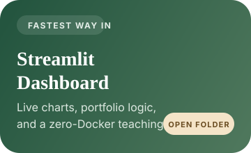
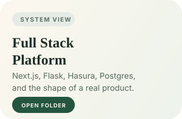
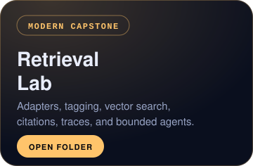

<p align="center">
  <a href="#start-here">
    
  </a>
</p>

<div align="center">

# Data Engineering with Python

[](https://github.com/mhdk1602/python_training/actions/workflows/ci.yml)
[](https://python.org)
[](react-app/)
[](chapter-10-rag-lab/)
[](notebooks/)
[](https://mhdk1602.github.io/python_training/)
[](LICENSE)

[Start Here](#start-here) • [Quick Start](#quick-start) • [Roadmap](#learning-roadmap) • [Repository Shape](#repository-shape) • [Embeddings Bridge](https://mhdk1602.github.io/python_training/embeddings-bridge.html) • [Fractal Studio](https://mhdk1602.github.io/python_training/fractals-governance.html) • [Fractal Graphs](https://mhdk1602.github.io/python_training/fractal-graphs.html) • [Governance Studio](https://mhdk1602.github.io/python_training/governance-studio.html) • [Indexing Studio](https://mhdk1602.github.io/python_training/indexing-studio.html) • [Orchestration Studio](https://mhdk1602.github.io/python_training/orchestration-studio.html)

</div>

I built this repo as a cumulative sequence. The early notebooks teach Python, data modeling, storage, processing, and streaming. Later chapters stop talking in abstractions and force those ideas into two concrete surfaces: a trading product and a retrieval system with citations, traces, and bounded tools. The newest material adds an advanced lens on MDM, governance, fractals, and pattern recognition.

> One notebook spine. Two applied systems. One advanced lens that asks harder questions about scale, structure, and governance.

## Start Here

<table>
  <tr>
    <td width="33%" valign="top" align="center">
      <a href="streamlit-app/">
        
      </a>
      <br><br>
      <strong><a href="streamlit-app/">Streamlit Dashboard</a></strong><br>
      Fastest payoff. Open the teaching surface without Docker.<br><br>
      <a href="#option-a-streamlit-dashboard-no-docker">Run guide</a>
    </td>
    <td width="33%" valign="top" align="center">
      <a href="react-app/">
        
      </a>
      <br><br>
      <strong><a href="react-app/">Full Stack Platform</a></strong><br>
      See the system as a product: UI, API, database, and orchestration.<br><br>
      <a href="#option-b-full-stack-docker-platform">Run guide</a>
    </td>
    <td width="33%" valign="top" align="center">
      <a href="chapter-10-rag-lab/">
        
      </a>
      <br><br>
      <strong><a href="chapter-10-rag-lab/">Retrieval Lab</a></strong><br>
      Modern capstone: adapters, tagging, vector search, citations, and bounded agents.<br><br>
      <a href="#option-c-retrieval-systems-capstone">Run guide</a>
    </td>
  </tr>
</table>

## Repository Shape

| Layer | What it teaches | Where to go |
|:------|:----------------|:------------|
| **Notebook spine** | Python, schema design, storage, processing, streaming, embeddings, LLMs, and quality checks. | [`notebooks/`](notebooks/) |
| **Embeddings bridge** | A public interactive map and two bridge notebooks that connect embeddings to vector stores, chunking, metadata filters, and retrieval payloads. | [`notebooks/07-text-and-embeddings/`](notebooks/07-text-and-embeddings/) · [`embeddings-bridge.html`](embeddings-bridge.html) |
| **Applied system A** | A trading product with Next.js, Flask, Hasura, Postgres, Streamlit, and the Ask Warren analysis surface. | [`react-app/`](react-app/) · [`flask-app/`](flask-app/) · [`streamlit-app/`](streamlit-app/) |
| **Applied system B** | A retrieval lab with source adapters, normalization, tagging, chunking, Chroma, FastAPI answers, and bounded agents. | [`chapter-10-rag-lab/`](chapter-10-rag-lab/) · [`react-app/pages/chapter-10.tsx`](react-app/pages/chapter-10.tsx) |
| **Advanced lens** | A new notebook cluster and public interactive page on Mandelbrot intuition, fractal descriptors, pattern recognition, MDM, governance, and duplicate-cluster instability. | [`notebooks/11-fractals-pattern-recognition-governance/`](notebooks/11-fractals-pattern-recognition-governance/) · [`fractals-governance.html`](fractals-governance.html) |
| **Fractal graphs studio** | Eight notebooks and an interactive page that walk three bridges: visibility graphs from time series, box-covering on networks, and lineage as a stewardship object. Closes with the failure-modes notebook. | [`notebooks/12-fractal-graphs/`](notebooks/12-fractal-graphs/) · [`fractal-graphs.html`](fractal-graphs.html) |
| **Fractal governance studio** | Nine notebooks and an interactive page that braid institutional theory, fractal-graph descriptors, and AI governance. Multi-scale pressure fields, the decoupling lens, the regulation cascade, and an Anthropic-backed parser with mock fallback. | [`notebooks/13-fractal-governance/`](notebooks/13-fractal-governance/) · [`governance-studio.html`](governance-studio.html) |
| **Fractal indexing studio** | Nine notebooks and an interactive page that show why the indexes you ship every day are fractal. Hilbert and Z-order curves built in NumPy, the Faloutsos selectivity oracle revived, a tiny pure-Python HNSW, a DuckDB Liquid Clustering benchmark, and Hurst-driven time-series partitioning. | [`notebooks/14-fractal-indexing/`](notebooks/14-fractal-indexing/) · [`indexing-studio.html`](indexing-studio.html) |
| **Orchestration studio** | Nine notebooks and an interactive page that build a pure-Python asset-graph orchestrator: topological materialization, idempotent backfills, sensors and freshness, the repo's real dbt models parsed into a DAG, retries and blast radius, a Dagster mapping, and the failure-mode closer. | [`notebooks/15-orchestration/`](notebooks/15-orchestration/) · [`orchestration-studio.html`](orchestration-studio.html) |
| **Teaching contract** | The repo uses NPS as the Chapter 10 worked example, but the retrieval interfaces stay generic so learners can swap the source. | [`chapter-10-rag-lab/README.md`](chapter-10-rag-lab/README.md) |

## Tracks At A Glance

| Track | What learners actually build | Chapters |
|:------|:-----------------------------|:---------|
| **Python and data engineering** | data pipelines, schema thinking, storage patterns | 0–5 |
| **Backend and APIs** | REST endpoints, GraphQL layers, Docker orchestration | 3, 6 |
| **Frontend and UI** | a Next.js dashboard and a Streamlit teaching surface | 6 |
| **GenAI and retrieval** | embeddings, vector search, retrieval evaluation, grounded answers, bounded agents | 7.1–7.5, 8, 10 |
| **Data quality** | validation checks, dbt models, and control discipline | 9 |
| **MDM and governance** | golden records, stewardship, reference domains, hierarchy control | 9.3, 11 |
| **Research casework** | threshold-sensitive duplicate clusters and governed entity resolution | 11.4, 12.6 |
| **Network science** | visibility graphs, box-covering on networks, skeleton extraction, renormalization | 12.1–12.4 |
| **Lineage and stewardship** | data lineage as a graph, fault propagation, blast-radius descriptors | 12.5 |
| **Institutional theory in code** | multi-scale pressure fields, decoupling dimension, translation cascade with TF-IDF drift | 13.1–13.6 |
| **AI as subject and agent** | provenance graph for an LLM and an Anthropic-backed parser with mock fallback | 13.5 |
| **Fractal indexing engineering** | Hilbert and Z-order curves, Hilbert R-tree bulk loading, fractal-dimension selectivity, HNSW small-world, Liquid Clustering, Hurst-aware partitioning | 14.1–14.7 |
| **Finance casework** | market data views, portfolio summaries, AI-assisted analysis | 6, 8 |

---

## Quick Start

If you only have thirty minutes, do the Streamlit route. If you want the repo as a system, run the Docker stack. If you care about retrieval, citations, and agent boundaries, jump straight to Chapter 10.

If you want the sharpest conceptual extension after that, open the public fractal studio. It is the fastest way into the new MDM, governance, pattern-recognition, and duplicate-cluster case-study material.

If you want the cleanest path from embeddings to retrieval, open the embeddings bridge page before Chapter 10.

### Prerequisites

- Python 3.10+
- Git
- Docker & Docker Compose (for the full-stack platform)
- Node.js 18+ (for the NextJS frontend)

### Option A: Streamlit Dashboard (No Docker)

The fastest way to see the trading platform in action. Zero infrastructure.

```bash
git clone https://github.com/mhdk1602/python_training.git
cd python_training/streamlit-app

pip install -r requirements.txt
streamlit run app.py
# Opens at localhost:8501 with live market data, portfolio tracking, and charts
```

### Option B: Full-Stack Docker Platform

Launches Postgres, Hasura, NextJS, and Flask for the complete architecture experience.

```bash
git clone https://github.com/mhdk1602/python_training.git
cd python_training

docker compose up -d

# Services available after startup:
#   Postgres        -> localhost:5437
#   Hasura Console  -> localhost:8080
#   NextJS App      -> localhost:3000
#   Flask API       -> localhost:5002
```

### Option C: Retrieval Systems Capstone

Run the Chapter 10 retrieval lab with its own FastAPI service and the dedicated Next.js teaching surface.

Start with `10.0` if you want the cleanest introduction to hybrid search, reranking, and retrieval evaluation before the larger capstone system.

```bash
cd python_training/chapter-10-rag-lab

python3 -m venv .venv
source .venv/bin/activate
pip install -e .[dev]
uvicorn main:app --reload --port 8001

# Open the demo route in the existing NextJS app:
#   http://localhost:3000/chapter-10
```

### Running Notebooks

```bash
pip install jupyter
jupyter notebook
```

Chapters 0-5 and 7-11 are self-contained. Chapter 6 requires Docker services (Option B).

### Option D: Public Fractal Studio

No local setup required. This is the interactive front door for the new advanced material.

- Live page: [mhdk1602.github.io/python_training/fractals-governance.html](https://mhdk1602.github.io/python_training/fractals-governance.html)
- Notebook path: [`notebooks/11-fractals-pattern-recognition-governance/`](notebooks/11-fractals-pattern-recognition-governance/)
- Primer first: [`9.3 Master Data Management and Governance.ipynb`](notebooks/09-data-quality/9.3%20Master%20Data%20Management%20and%20Governance.ipynb)

### Option E: Embeddings Bridge Page

No local setup required. This is the new bridge between the embeddings notebooks and the retrieval capstone.

- Live page: [mhdk1602.github.io/python_training/embeddings-bridge.html](https://mhdk1602.github.io/python_training/embeddings-bridge.html)
- Bridge notebooks: [`7.4 Vector Stores and Similarity Search.ipynb`](notebooks/07-text-and-embeddings/7.4%20Vector%20Stores%20and%20Similarity%20Search.ipynb) and [`7.5 Chunking, Metadata, and Retrieval Bridges.ipynb`](notebooks/07-text-and-embeddings/7.5%20Chunking%2C%20Metadata%2C%20and%20Retrieval%20Bridges.ipynb)

### Option F: Fractal Graphs Studio

The Chapter 12 front door. Three working labs: a visibility-graph builder you can drag-edit, a box-covering visualizer with a stable-vs-unstable slope readout, and a lineage-risk panel that ranks stewardship priorities by blast radius.

- Live page: [mhdk1602.github.io/python_training/fractal-graphs.html](https://mhdk1602.github.io/python_training/fractal-graphs.html)
- Notebook path: [`notebooks/12-fractal-graphs/`](notebooks/12-fractal-graphs/)
- Reads after Chapter 11. Requires `networkx`, `python-louvain`, `powerlaw` (chapter-local `requirements.txt`)

### Option G: Fractal Governance Studio

The Chapter 13 front door. Three labs braid institutional theory, fractal-graph descriptors, and AI governance: a multi-scale pressure field with five scales and a dominant-mechanism radar, a decoupling lens that scores per-scale RMSE between formal and operational signals, and a regulation translation cascade that recomputes drift between adjacent layers as you edit them.

- Live page: [mhdk1602.github.io/python_training/governance-studio.html](https://mhdk1602.github.io/python_training/governance-studio.html)
- Notebook path: [`notebooks/13-fractal-governance/`](notebooks/13-fractal-governance/)
- Reads after Chapters 11 and 12. Requires `networkx`, `python-louvain`, `scikit-learn`, optional `anthropic` (chapter-local `requirements.txt`)

### Option H: Fractal Indexing Studio

The Chapter 14 front door for engineers. Three labs make the fractal mathematics inside production indexes visible. Animate a Hilbert or Z-order curve through a 32x32 grid and drag a query rectangle to see the page-fetch counter change. Race four orderings (row-major, Z-order, Hilbert, R-tree) on 5,000 skewed points with a draggable query box. Drop a query into a tiny HNSW and watch the search descend layer by layer.

- Live page: [mhdk1602.github.io/python_training/indexing-studio.html](https://mhdk1602.github.io/python_training/indexing-studio.html)
- Notebook path: [`notebooks/14-fractal-indexing/`](notebooks/14-fractal-indexing/)
- Reads independently of Chapters 11-13 (engineers welcome). Requires `numpy`, `pandas`, `scipy`, `networkx`, `rtree`, `duckdb`, `pyarrow` (chapter-local `requirements.txt`)

## If You Like To Learn By...

| Learning style | Start here | Then go next |
|:---------------|:-----------|:-------------|
| **Shipping something quickly** | `streamlit-app/` | Chapter 6, then Chapter 8 |
| **Understanding architecture** | Docker stack + `react-app/` | Chapter 6, then Chapter 9 |
| **Modern GenAI systems** | `chapter-10-rag-lab/` | Chapters 7, 8, and 10 together |
| **Understanding vector search** | public embeddings bridge + Chapter 7 notebooks | 7.1–7.5, then 10 |
| **Research-oriented advanced work** | public fractal studio + Chapter 11 notebooks | 9.3, then 11.1–11.4 |
| **Network science and graph fractals** | public fractal-graphs studio + Chapter 12 notebooks | 11, then 12.0–12.7 |
| **Institutional theory in code** | public governance studio + Chapter 13 notebooks | 11, 12, then 13.0–13.8 |
| **Working from first principles** | Chapters 0–5 notebooks | then whichever product surface you want to dissect |

---

## Learning Roadmap

Each chapter builds on the previous. Difficulty and estimated time are noted to help you plan your learning.

<details>
<summary><b>Chapter 0: Fundamentals</b>&nbsp;&nbsp;<code>Beginner</code>&nbsp;&nbsp;<code>~4 hours</code></summary>

<br>

Your starting point. Git, Python basics, Jupyter, and core programming patterns.

| # | Topic | Notebook |
|---|-------|----------|
| 0.0 | Introduction to GitHub | [0. Git Fundamentals.ipynb](notebooks/00-fundamentals/0.%20Git%20Fundamentals.ipynb) |
| 0.1 | Getting Started with Python | [0.1 Getting Started - Python.ipynb](notebooks/00-fundamentals/0.1%20Getting%20Started%20-%20Python.ipynb) |
| 0.2 | Jupyter Notebooks | [0.2 Jupyter - Intro.ipynb](notebooks/00-fundamentals/0.2%20Jupyter%20-%20Intro.ipynb) |
| 0.3 | Functions | [0.3 Functions.ipynb](notebooks/00-fundamentals/0.3%20Functions.ipynb) |
| 0.4 | Looping | [0.4 Looping.ipynb](notebooks/00-fundamentals/0.4%20Looping.ipynb) |
| 0.5 | Reading Data | [0.5 Reading-Data.ipynb](notebooks/00-fundamentals/0.5%20Reading-Data.ipynb) |

</details>

<details>
<summary><b>Chapter 1: Introduction to Data Engineering</b>&nbsp;&nbsp;<code>Beginner</code>&nbsp;&nbsp;<code>~3 hours</code></summary>

<br>

What data engineering is, the terminology you need, and the data formats you will encounter daily.

| # | Topic | Notebook |
|---|-------|----------|
| 1.1 | Overview & Role in the Data Pipeline | [1.1 Fundamentals.ipynb](notebooks/01-intro-data-engineering/1.1%20Fundamentals.ipynb) |
| 1.2 | Key Concepts & Terminology | [1.2 Key concepts and terminology.ipynb](notebooks/01-intro-data-engineering/1.2%20Key%20concepts%20and%20terminology.ipynb) |
| 1.3 | Common Data Formats & Structures | [1.3 Data Formats & Structures.ipynb](notebooks/01-intro-data-engineering/1.3%20Data%20Formats%20%26%20Structures.ipynb) |

</details>

<details>
<summary><b>Chapter 2: Data Modeling & Schema Design</b>&nbsp;&nbsp;<code>Intermediate</code>&nbsp;&nbsp;<code>~5 hours</code></summary>

<br>

Relational and NoSQL modeling patterns. You will design schemas for the trading platform's data layer.

| # | Topic | Notebook |
|---|-------|----------|
| 2.1 | Data Modeling Introduction | [2.1 Data Modeling.ipynb](notebooks/02-data-modeling/2.1%20Data%20Modeling.ipynb) |
| 2.2 | NoSQL Databases | [2.2 NoSQL DB.ipynb](notebooks/02-data-modeling/2.2%20NoSQL%20DB.ipynb) |
| 2.3 | Schema Modeling | [2.3 Schema Modeling.ipynb](notebooks/02-data-modeling/2.3%20Schema%20Modeling.ipynb) |
| 2.4 | Data Modeling Exercise | [2.4 Data Modeling - Exercise.ipynb](notebooks/02-data-modeling/2.4%20Data%20Modeling%20-%20Exercise.ipynb) |

</details>

<details>
<summary><b>Chapter 3: Data Storage & Retrieval</b>&nbsp;&nbsp;<code>Intermediate</code>&nbsp;&nbsp;<code>~3 hours</code></summary>

<br>

File systems, databases, data lakes. Reading and writing CSV, JSON, Parquet in Python.

| # | Topic | Notebook |
|---|-------|----------|
| 3 | Storage Systems & Best Practices | [3. Data Storage and Retrieval.ipynb](notebooks/03-data-storage/3.%20Data%20Storage%20and%20Retrieval.ipynb) |

</details>

<details>
<summary><b>Chapter 4: Data Processing & Transformation</b>&nbsp;&nbsp;<code>Intermediate</code>&nbsp;&nbsp;<code>~5 hours</code></summary>

<br>

Data cleaning, filtering, aggregation. Hands-on with Pandas, NumPy, and Dask for scalable pipelines.

| # | Topic | Notebook |
|---|-------|----------|
| 4 | Processing & Transformation | [4. Data Processing and Transformation.ipynb](notebooks/04-data-processing/4.%20Data%20Processing%20and%20Transformation.ipynb) |

</details>

<details>
<summary><b>Chapter 5: Data Streaming & Real-time Processing</b>&nbsp;&nbsp;<code>Advanced</code>&nbsp;&nbsp;<code>~4 hours</code></summary>

<br>

Apache Kafka, Apache Flink, Faust. Building real-time data processing pipelines in Python.

| # | Topic | Notebook |
|---|-------|----------|
| 5 | Streaming & Real-time Pipelines | [5. Data Streaming and Real-time Processing.ipynb](notebooks/05-data-streaming/5.%20Data%20Streaming%20and%20Real-time%20Processing.ipynb) |

</details>

<details>
<summary><b>Chapter 6: Data Integration, APIs & Frontend</b>&nbsp;&nbsp;<code>Advanced</code>&nbsp;&nbsp;<code>~10 hours</code></summary>

<br>

The largest chapter. Build the full trading platform: REST APIs, GraphQL with Hasura, a NextJS frontend, and an AI chatbot.

| # | Topic | Notebook |
|---|-------|----------|
| 6.1 | Data Integration with APIs | [6.1 Data Integrations with APIs.ipynb](notebooks/06-apis-and-frontend/6.1%20Data%20Integrations%20with%20APIs.ipynb) |
| 6.2 | APIs (continued) | [6.2 Data Integrations with APIs - contd.ipynb](notebooks/06-apis-and-frontend/6.2%20Data%20Integrations%20with%20APIs%20-%20contd.ipynb) |
| 6.3 | Introduction to GraphQL | [6.3 GraphQL.ipynb](notebooks/06-apis-and-frontend/6.3%20GraphQL.ipynb) |
| 6.4.1 | Postgres & Postgraphile Setup | [6.4.1 Postgres Postgraphile setup.ipynb](notebooks/06-apis-and-frontend/6.4.1%20Postgres%20Postgraphile%20setup.ipynb) |
| 6.4.2 | NextJS Implementation | [6.4.2 NextJS Implementation.ipynb](notebooks/06-apis-and-frontend/6.4.2%20NextJS%20Implementation.ipynb) |
| 6.5 | Migration to Hasura | [6.5 Hasura - GraphQL.ipynb](notebooks/06-apis-and-frontend/6.5%20Hasura%20-%20GraphQL.ipynb) |
| 6.6 | Frontend Chatbot App | [6.6 Frontend Chatbot App.ipynb](notebooks/06-apis-and-frontend/6.6%20Frontend%20Chatbot%20App.ipynb) |

> **Note**: Section 6.6 is best completed after Chapter 7 (Text Comparison & Embeddings).

**Sub-projects built in this chapter:**
- `react-app/` -- NextJS stock trading dashboard with Apollo Client and Tailwind CSS
- `streamlit-app/` -- Standalone Python dashboard (same features, no Docker required)
- `flask-app/` -- Flask API serving market data, news, and the "Ask Warren" AI chatbot
- `postgres/` -- Database initialization scripts
- `GraphQL Server/` -- Standalone Node.js GraphQL server

</details>

<details>
<summary><b>Chapter 7: Text Comparison & Embeddings</b>&nbsp;&nbsp;<code>Advanced</code>&nbsp;&nbsp;<code>~6 hours</code></summary>

<br>

Fuzzy matching, Levenshtein distance, TF-IDF, vector embeddings, bridge notebooks for vector stores and chunking, and Elasticsearch integration.

| # | Topic | Notebook |
|---|-------|----------|
| 7.0 | Text Comparison Algorithms | [7. Text Comparison.ipynb](notebooks/07-text-and-embeddings/7.%20Text%20Comparison.ipynb) |
| 7.1 | Text Embeddings | [7.1 Embeddings.ipynb](notebooks/07-text-and-embeddings/7.1%20Embeddings.ipynb) |
| 7.2 | Embeddings in Data Engineering | [7.2 Embeddings - Contd.ipynb](notebooks/07-text-and-embeddings/7.2%20Embeddings%20-%20Contd.ipynb) |
| 7.3 | Embeddings with Elasticsearch | [7.3 Embeddings - Elasticsearch.ipynb](notebooks/07-text-and-embeddings/7.3%20Embeddings%20-%20Elasticsearch.ipynb) |
| 7.4 | Vector Stores and Similarity Search | [7.4 Vector Stores and Similarity Search.ipynb](notebooks/07-text-and-embeddings/7.4%20Vector%20Stores%20and%20Similarity%20Search.ipynb) |
| 7.5 | Chunking, Metadata, and Retrieval Bridges | [7.5 Chunking, Metadata, and Retrieval Bridges.ipynb](notebooks/07-text-and-embeddings/7.5%20Chunking%2C%20Metadata%2C%20and%20Retrieval%20Bridges.ipynb) |

</details>

<details>
<summary><b>Chapter 8: Generative AI & LLMs</b>&nbsp;&nbsp;<code>Advanced</code>&nbsp;&nbsp;<code>~6 hours</code></summary>

<br>

From GPT-4 fundamentals to building an Anthropic-powered chatbot with LangChain.

| # | Topic | Notebook |
|---|-------|----------|
| 8.0 | GPT-4 Primer | [Chatbot - GPT4- Primer.docx](notebooks/08-genai-llms/GPT4-Chatbot/Chatbot%20-%20GPT4-%20Primer.docx) |
| 8.2 | Anthropic Setup | [8.2 Anthropic setup.ipynb](notebooks/08-genai-llms/8.2%20Anthropic%20setup.ipynb) |
| 8.3 | Anthropic Chatbot Playbook | [8.3 Chatbot - Anthropic - Playbook.ipynb](notebooks/08-genai-llms/8.3%20Chatbot%20-%20Anthropic%20-%20Playbook.ipynb) |
| 8.4 | LangChain | [8.4 Langchain.ipynb](notebooks/08-genai-llms/8.4%20Langchain.ipynb) |

</details>

<details>
<summary><b>Chapter 9: Data Quality & Validation</b>&nbsp;&nbsp;<code>Intermediate</code>&nbsp;&nbsp;<code>~4 hours</code></summary>

<br>

Validation frameworks, implementing data quality checks with dbt, and a primer on master data management and governance.

| # | Topic | Notebook |
|---|-------|----------|
| 9.1 | Importance, Techniques & Frameworks | [9.1 Data Quality and Validation.ipynb](notebooks/09-data-quality/9.1%20Data%20Quality%20and%20Validation.ipynb) |
| 9.2 | Data Quality with dbt | [9.2 DQ - Dbt.ipynb](notebooks/09-data-quality/9.2%20DQ%20-%20Dbt.ipynb) |
| 9.3 | Master Data Management and Governance | [9.3 Master Data Management and Governance.ipynb](notebooks/09-data-quality/9.3%20Master%20Data%20Management%20and%20Governance.ipynb) |

**Sub-project:** `dbt/dbt_dq/` -- dbt project with NYC taxi data models and custom quality tests.

</details>

<details>
<summary><b>Chapter 10: Retrieval Systems & Agents</b>&nbsp;&nbsp;<code>Advanced</code>&nbsp;&nbsp;<code>~8 hours</code></summary>

<br>

Build a full retrieval stack with generic contracts, NPS as the worked example, and a separate modern UI for tracing answers back to evidence. The chapter now opens with a retrieval-evaluation prelude so ranking quality is explicit before answer synthesis starts.

| # | Topic | Notebook |
|---|-------|----------|
| 10.0 | Retrieval Evaluation, Hybrid Search, and Reranking | [10.0 Retrieval Evaluation, Hybrid Search, and Reranking.ipynb](notebooks/10-retrieval-systems-and-agents/10.0%20Retrieval%20Evaluation%2C%20Hybrid%20Search%2C%20and%20Reranking.ipynb) |
| 10.1 | System Frame: From Raw Content to Answer | [10.1 System Frame.ipynb](notebooks/10-retrieval-systems-and-agents/10.1%20System%20Frame.ipynb) |
| 10.2 | Source Adapters and Ingestion | [10.2 Source Adapters and Ingestion.ipynb](notebooks/10-retrieval-systems-and-agents/10.2%20Source%20Adapters%20and%20Ingestion.ipynb) |
| 10.3 | Content Normalization and Tagging | [10.3 Content Normalization and Tagging.ipynb](notebooks/10-retrieval-systems-and-agents/10.3%20Content%20Normalization%20and%20Tagging.ipynb) |
| 10.4 | Embeddings and the Local Vector Store | [10.4 Embeddings and the Local Vector Store.ipynb](notebooks/10-retrieval-systems-and-agents/10.4%20Embeddings%20and%20the%20Local%20Vector%20Store.ipynb) |
| 10.5 | Retrieval and Grounded Answers | [10.5 Retrieval and Grounded Answers.ipynb](notebooks/10-retrieval-systems-and-agents/10.5%20Retrieval%20and%20Grounded%20Answers.ipynb) |
| 10.6 | Agentic Q&A | [10.6 Agentic Q&A.ipynb](notebooks/10-retrieval-systems-and-agents/10.6%20Agentic%20Q%26A.ipynb) |
| 10.7 | Demo UI and Evaluation | [10.7 Demo UI and Evaluation.ipynb](notebooks/10-retrieval-systems-and-agents/10.7%20Demo%20UI%20and%20Evaluation.ipynb) |

**Sub-project:** `chapter-10-rag-lab/` -- FastAPI retrieval lab with source adapters, content tagging, local-first embeddings, grounded answers, and a bounded agent.  
**Demo route:** `react-app/pages/chapter-10.tsx`

</details>

<details>
<summary><b>Chapter 11: Fractals, Pattern Recognition, and Governance</b>&nbsp;&nbsp;<code>Advanced</code>&nbsp;&nbsp;<code>~8 hours</code></summary>

<br>

An advanced lens that starts with Mandelbrot intuition, moves into fractal descriptors for pattern recognition, and ends with a bounded framework plus a concrete duplicate-cluster case study for MDM and governance.

| # | Topic | Notebook |
|---|-------|----------|
| 11.1 | Fractals and the Mandelbrot Set | [11.1 Fractals and the Mandelbrot Set.ipynb](notebooks/11-fractals-pattern-recognition-governance/11.1%20Fractals%20and%20the%20Mandelbrot%20Set.ipynb) |
| 11.2 | Fractal Features for Pattern Recognition | [11.2 Fractal Features for Pattern Recognition.ipynb](notebooks/11-fractals-pattern-recognition-governance/11.2%20Fractal%20Features%20for%20Pattern%20Recognition.ipynb) |
| 11.3 | Fractals, MDM, and Data Governance | [11.3 Fractals, MDM, and Data Governance.ipynb](notebooks/11-fractals-pattern-recognition-governance/11.3%20Fractals%2C%20MDM%2C%20and%20Data%20Governance.ipynb) |
| 11.4 | Enterprise Case Study - Duplicate Clusters | [11.4 Enterprise Case Study - Duplicate Clusters.ipynb](notebooks/11-fractals-pattern-recognition-governance/11.4%20Enterprise%20Case%20Study%20-%20Duplicate%20Clusters.ipynb) |

**Public studio:** [mhdk1602.github.io/python_training/fractals-governance.html](https://mhdk1602.github.io/python_training/fractals-governance.html)  
**Primer first:** `9.3 Master Data Management and Governance.ipynb`

</details>

<details>
<summary><b>Chapter 12: Fractal Graphs</b>&nbsp;&nbsp;<code>Advanced</code>&nbsp;&nbsp;<code>~10 hours</code></summary>

<br>

A graph-theoretic extension of Chapter 11. Three formal bridges (time series to graph, image to graph, governance to graph), eight notebooks, and a public studio page with three interactive labs. The closing notebook names the four failure modes so the descriptors do not get oversold.

| # | Topic | Notebook |
|---|-------|----------|
| 12.0 | Why Graphs Deserve a Fractal Lens | [12.0 Why Graphs Deserve a Fractal Lens.ipynb](notebooks/12-fractal-graphs/12.0%20Why%20Graphs%20Deserve%20a%20Fractal%20Lens.ipynb) |
| 12.1 | Graphs as the Next Geometry | [12.1 Graphs as the Next Geometry.ipynb](notebooks/12-fractal-graphs/12.1%20Graphs%20as%20the%20Next%20Geometry.ipynb) |
| 12.2 | Visibility Graphs from Time Series | [12.2 Visibility Graphs from Time Series.ipynb](notebooks/12-fractal-graphs/12.2%20Visibility%20Graphs%20from%20Time%20Series.ipynb) |
| 12.3 | Box Covering on Graphs | [12.3 Box Covering on Graphs.ipynb](notebooks/12-fractal-graphs/12.3%20Box%20Covering%20on%20Graphs.ipynb) |
| 12.4 | Skeletons, Hubs, and Renormalization | [12.4 Skeletons, Hubs, and Renormalization.ipynb](notebooks/12-fractal-graphs/12.4%20Skeletons%2C%20Hubs%2C%20and%20Renormalization.ipynb) |
| 12.5 | Lineage Graphs and Fault Propagation | [12.5 Lineage Graphs and Fault Propagation.ipynb](notebooks/12-fractal-graphs/12.5%20Lineage%20Graphs%20and%20Fault%20Propagation.ipynb) |
| 12.6 | Entity Resolution Revisited as a Graph | [12.6 Entity Resolution Revisited as a Graph.ipynb](notebooks/12-fractal-graphs/12.6%20Entity%20Resolution%20Revisited%20as%20a%20Graph.ipynb) |
| 12.7 | When Fractal Descriptors Mislead on Graphs | [12.7 When Fractal Descriptors Mislead on Graphs.ipynb](notebooks/12-fractal-graphs/12.7%20When%20Fractal%20Descriptors%20Mislead%20on%20Graphs.ipynb) |

**Public studio:** [mhdk1602.github.io/python_training/fractal-graphs.html](https://mhdk1602.github.io/python_training/fractal-graphs.html)  
**Reads after:** Chapter 11.  
**Chapter-local deps:** `networkx>=3.2`, `python-louvain>=0.16`, `powerlaw>=1.5` ([`requirements.txt`](notebooks/12-fractal-graphs/requirements.txt))  
**Citations grounding the chapter:** Song-Havlin-Makse (2005), Lacasa et al. (2008), Skums-Bunimovich (2020), Malemapti Hari (2026, Zenodo).

</details>

<details>
<summary><b>Chapter 13: Fractal Governance</b>&nbsp;&nbsp;<code>Advanced</code>&nbsp;&nbsp;<code>~12 hours</code></summary>

<br>

Three research streams (institutional theory, fractal-graph descriptors, AI governance) braided in code. Nine notebooks build a multi-scale pressure-field model, a decoupling-dimension measure, a governance knowledge graph, visibility-graph signatures of governance time series, an Anthropic-backed parser with deterministic mock fallback, a regulation translation cascade, a printable capstone diagnostic, and an honesty closer that names four failure modes.

| # | Topic | Notebook |
|---|-------|----------|
| 13.0 | Why Governance Needs a Fractal Lens | [13.0 Why Governance Needs a Fractal Lens.ipynb](notebooks/13-fractal-governance/13.0%20Why%20Governance%20Needs%20a%20Fractal%20Lens.ipynb) |
| 13.1 | The Multi-Scale Pressure Field | [13.1 The Multi-Scale Pressure Field.ipynb](notebooks/13-fractal-governance/13.1%20The%20Multi-Scale%20Pressure%20Field.ipynb) |
| 13.2 | Decoupling as Multi-Scale Decoherence | [13.2 Decoupling as Multi-Scale Decoherence.ipynb](notebooks/13-fractal-governance/13.2%20Decoupling%20as%20Multi-Scale%20Decoherence.ipynb) |
| 13.3 | The Governance Knowledge Graph | [13.3 The Governance Knowledge Graph.ipynb](notebooks/13-fractal-governance/13.3%20The%20Governance%20Knowledge%20Graph.ipynb) |
| 13.4 | Visibility Graphs of Governance Time Series | [13.4 Visibility Graphs of Governance Time Series.ipynb](notebooks/13-fractal-governance/13.4%20Visibility%20Graphs%20of%20Governance%20Time%20Series.ipynb) |
| 13.5 | AI as Governance Subject and Agent | [13.5 AI as Governance Subject and Agent.ipynb](notebooks/13-fractal-governance/13.5%20AI%20as%20Governance%20Subject%20and%20Agent.ipynb) |
| 13.6 | The Translation Cascade | [13.6 The Translation Cascade.ipynb](notebooks/13-fractal-governance/13.6%20The%20Translation%20Cascade.ipynb) |
| 13.7 | Capstone Lab: Build Your Own Governance Pressure Map | [13.7 Capstone Lab.ipynb](notebooks/13-fractal-governance/13.7%20Capstone%20Lab.ipynb) |
| 13.8 | When the Visualization Lies | [13.8 When the Visualization Lies.ipynb](notebooks/13-fractal-governance/13.8%20When%20the%20Visualization%20Lies.ipynb) |

**Public studio:** [mhdk1602.github.io/python_training/governance-studio.html](https://mhdk1602.github.io/python_training/governance-studio.html)  
**Reads after:** Chapters 11 and 12.  
**Chapter-local deps:** `networkx>=3.2`, `python-louvain>=0.16`, `scikit-learn>=1.3`, `scipy`, optional `anthropic>=0.25` ([`requirements.txt`](notebooks/13-fractal-governance/requirements.txt))  
**Citations grounding the chapter:** DiMaggio and Powell (1983), Meyer and Rowan (1977), Scott (2008), Greenwood et al. (2011), Birkstedt et al. (2023), Mäntymäki et al. (2022), Papagiannidis et al. (2025), Longpre et al. (2024), Skums and Bunimovich (2020), Lacasa et al. (2008), Malemapti Hari (2026, Zenodo).

</details>

<details>
<summary><b>Chapter 14: Fractal Indexing</b>&nbsp;&nbsp;<code>Advanced</code>&nbsp;&nbsp;<code>~10 hours</code></summary>

<br>

The indexes you ship every day are fractal, the apparatus to reason about them is older than the production code, and the connection is rarely made explicit. Nine notebooks build Z-order and Hilbert curves in pure NumPy, reproduce the Kamel-Faloutsos (1994) Hilbert R-tree bulk loading and the Faloutsos-Kamel (1994) fractal-dimension selectivity formula, build a tiny pure-Python HNSW that exposes the small-world / scale-free structure, run a DuckDB Liquid Clustering benchmark on a laptop, drive time-series chunk boundaries by the Hurst exponent of the stream, and close with four named failure modes.

| # | Topic | Notebook |
|---|-------|----------|
| 14.0 | Why Indexes Are Already Fractal | [14.0 Why Indexes Are Already Fractal.ipynb](notebooks/14-fractal-indexing/14.0%20Why%20Indexes%20Are%20Already%20Fractal.ipynb) |
| 14.1 | Space-Filling Curves: Z-order, Hilbert, and Locality | [14.1 Space-Filling Curves.ipynb](notebooks/14-fractal-indexing/14.1%20Space-Filling%20Curves.ipynb) |
| 14.2 | Hilbert R-tree Bulk Loading | [14.2 Hilbert R-tree Bulk Loading.ipynb](notebooks/14-fractal-indexing/14.2%20Hilbert%20R-tree%20Bulk%20Loading.ipynb) |
| 14.3 | Fractal Dimension as a Selectivity Oracle | [14.3 Fractal Dimension as a Selectivity Oracle.ipynb](notebooks/14-fractal-indexing/14.3%20Fractal%20Dimension%20as%20a%20Selectivity%20Oracle.ipynb) |
| 14.4 | HNSW as a Hierarchical Small-World Index | [14.4 HNSW as a Hierarchical Small-World Index.ipynb](notebooks/14-fractal-indexing/14.4%20HNSW%20as%20a%20Hierarchical%20Small-World%20Index.ipynb) |
| 14.5 | Liquid Clustering at Home (DuckDB Z-order vs Hilbert) | [14.5 Liquid Clustering at Home.ipynb](notebooks/14-fractal-indexing/14.5%20Liquid%20Clustering%20at%20Home.ipynb) |
| 14.6 | Adaptive Chunking by Hurst Exponent | [14.6 Adaptive Chunking by Hurst Exponent.ipynb](notebooks/14-fractal-indexing/14.6%20Adaptive%20Chunking%20by%20Hurst%20Exponent.ipynb) |
| 14.7 | Capstone: Build Your Own Fractal Index for Your Workload | [14.7 Capstone Build Your Own Fractal Index.ipynb](notebooks/14-fractal-indexing/14.7%20Capstone%20Build%20Your%20Own%20Fractal%20Index.ipynb) |
| 14.8 | When the Speedup Is a Lie | [14.8 When the Speedup Is a Lie.ipynb](notebooks/14-fractal-indexing/14.8%20When%20the%20Speedup%20Is%20a%20Lie.ipynb) |

**Public studio:** [mhdk1602.github.io/python_training/indexing-studio.html](https://mhdk1602.github.io/python_training/indexing-studio.html)  
**Reads independently** of Chapters 11-13 (engineers welcome).  
**Chapter-local deps:** `numpy`, `pandas`, `scipy`, `matplotlib`, `networkx`, `rtree`, `duckdb`, `pyarrow` ([`requirements.txt`](notebooks/14-fractal-indexing/requirements.txt))  
**Citations grounding the chapter:** Kamel and Faloutsos (1994), Faloutsos and Kamel (1994), Belussi and Faloutsos (1995), Korn-Pagel-Faloutsos (2001), Malkov and Yashunin (2018, arXiv:1603.09320), Apache Iceberg PR #5824, Delta Lake 3.0 release notes, Banerjee (2026, Medium), Malemapti Hari (2026, Zenodo).

</details>

<details>
<summary><b>Chapter 15: Orchestration as Asset Graphs</b>&nbsp;&nbsp;<code>Advanced</code>&nbsp;&nbsp;<code>~8 hours</code></summary>

<br>

Cron runs scripts on a clock; an orchestrator materializes an asset graph in dependency order, skips work already done, and tells you what breaks when a node fails. Nine notebooks build a tiny pure-Python asset-graph orchestrator from scratch (topological materialization, idempotent backfills, sensors and freshness on a simulated clock), parse the repo's own `dbt/dbt_dq` models into a DAG, add skip-on-failure with retries and the Chapter 12 blast radius, map every concept onto Dagster, orchestrate the trading platform's data by trading day, and close with four named failure modes.

| # | Topic | Notebook |
|---|-------|----------|
| 15.0 | From Cron to Asset Graphs | [15.0 From Cron to Asset Graphs.ipynb](notebooks/15-orchestration/15.0%20From%20Cron%20to%20Asset%20Graphs.ipynb) |
| 15.1 | A Tiny Asset Graph From Scratch | [15.1 A Tiny Asset Graph From Scratch.ipynb](notebooks/15-orchestration/15.1%20A%20Tiny%20Asset%20Graph%20From%20Scratch.ipynb) |
| 15.2 | Partitions and Backfills | [15.2 Partitions and Backfills.ipynb](notebooks/15-orchestration/15.2%20Partitions%20and%20Backfills.ipynb) |
| 15.3 | Sensors and Freshness | [15.3 Sensors and Freshness.ipynb](notebooks/15-orchestration/15.3%20Sensors%20and%20Freshness.ipynb) |
| 15.4 | Wrapping the dbt Project as Assets | [15.4 Wrapping the dbt Project as Assets.ipynb](notebooks/15-orchestration/15.4%20Wrapping%20the%20dbt%20Project%20as%20Assets.ipynb) |
| 15.5 | Failure, Retries, and Blast Radius | [15.5 Failure, Retries, and Blast Radius.ipynb](notebooks/15-orchestration/15.5%20Failure%2C%20Retries%2C%20and%20Blast%20Radius.ipynb) |
| 15.6 | From Our Toy to Dagster | [15.6 From Our Toy to Dagster.ipynb](notebooks/15-orchestration/15.6%20From%20Our%20Toy%20to%20Dagster.ipynb) |
| 15.7 | Capstone: Orchestrate the Trading Platform's Data | [15.7 Capstone Orchestrate the Trading Platform.ipynb](notebooks/15-orchestration/15.7%20Capstone%20Orchestrate%20the%20Trading%20Platform.ipynb) |
| 15.8 | When the Schedule Lies | [15.8 When the Schedule Lies.ipynb](notebooks/15-orchestration/15.8%20When%20the%20Schedule%20Lies.ipynb) |

**Public studio:** [mhdk1602.github.io/python_training/orchestration-studio.html](https://mhdk1602.github.io/python_training/orchestration-studio.html)  
**Reads independently** of Chapters 11-14; connects to Chapter 9 (the dbt project) and Chapter 12 (lineage and blast radius).  
**Chapter-local deps:** `numpy`, `networkx`, `matplotlib`, `pandas` ([`requirements.txt`](notebooks/15-orchestration/requirements.txt))  
**Grounding:** Dagster software-defined assets (the production analogue mapped in 15.6); Airflow and Prefect compared in the same notebook; the asset-graph framing reuses the Chapter 12 lineage apparatus.

</details>

---

## Roadmap: Chapters On The Bench

Chapters 11-14 proved out a pattern: nine notebooks, three browser labs, one capstone, and a closing notebook that names the failure modes. The next four chapters apply that same pattern to the production-infrastructure gaps the curriculum still has. Order reflects dependency, not priority.

**Chapter 15 has shipped.** The notebooks live in [`notebooks/15-orchestration/`](notebooks/15-orchestration/) and the [Orchestration Studio](https://mhdk1602.github.io/python_training/orchestration-studio.html) is live. It builds a tiny asset-graph orchestrator from scratch (topological materialization, idempotent backfills, sensors, the repo's own dbt graph parsed into a DAG, retries, and the Chapter 12 blast radius), then maps every concept onto Dagster. The three remaining chapters are still on the bench:

| Chapter | Working title | What it teaches | Why it belongs here |
|:--------|:--------------|:----------------|:--------------------|
| **16** | Data Contracts and Change Capture | Log-based CDC (Debezium pattern), schema evolution, Pydantic and dbt contract tests, and what breaks downstream when a producer ships a silent type change. | Quality checks in Chapter 9 are consumer-side. Contracts move enforcement to the producer boundary, which is where governance actually has leverage. |
| **17** | Lakehouse Internals | Iceberg and Delta table formats: snapshots, manifests, time travel, compaction, and clustering. Includes a hands-on bridge to 14.5, since Iceberg's Hilbert clustering is the production face of the math in Chapter 14. | The repo benchmarks Liquid Clustering in DuckDB but never opens the table format underneath it. |
| **18** | Observability and Governance Telemetry | Freshness, volume, and distribution monitors; OpenLineage events; data SLAs; and how monitoring signals become evidence in a governance regime. | This closes the loop with Chapter 13: decoupling between formal policy and operational practice is measurable, and this chapter builds the instruments. |

Each chapter gets a public studio page like the existing seven. Suggestions and PRs against this roadmap are welcome; open an issue with the chapter number in the title.

---

## Tech Stack

<div align="center">

| Category | Technologies |
|:---------|:-------------|
| **Languages** | Python, TypeScript, JavaScript, SQL |
| **Data** | Pandas, NumPy, Dask, dbt |
| **Databases** | PostgreSQL, SQLite, Elasticsearch, Chroma |
| **APIs** | Flask, FastAPI, GraphQL, Hasura, Postgraphile |
| **Frontend** | Next.js 14, React 18, Apollo Client, Tailwind CSS, Streamlit |
| **AI/ML** | Anthropic Claude, LangChain, Ollama, TF-IDF, Vector Embeddings, Bounded Agents |
| **Infrastructure** | Docker, Docker Compose, GitHub Actions |
| **Visualization** | Plotly, Matplotlib |
| **Finance** | yfinance, News Sentiment Analysis |

</div>

---

## Repository Structure

```
python_training/
  notebooks/
    00-fundamentals/          # Git, Python basics, Jupyter, loops, I/O
    01-intro-data-engineering/ # Data engineering overview & terminology
    02-data-modeling/          # Relational & NoSQL schema design
    03-data-storage/           # Storage systems, CSV/JSON/Parquet
    04-data-processing/        # Pandas, NumPy, Dask pipelines
    05-data-streaming/         # Kafka, Flink, real-time processing
    06-apis-and-frontend/      # REST, GraphQL, NextJS, chatbot
    07-text-and-embeddings/    # Fuzzy matching, TF-IDF, Elasticsearch
    08-genai-llms/             # GPT-4, Anthropic, LangChain
    09-data-quality/           # Validation frameworks, dbt, MDM, governance
    10-retrieval-systems-and-agents/ # Retrieval systems, tagging, vector stores, agents
    11-fractals-pattern-recognition-governance/ # Mandelbrot, pattern recognition, governance
    12-fractal-graphs/         # Fractal graphs: visibility, box-covering, lineage, ER upgrade
    13-fractal-governance/     # Multi-scale pressure fields, decoupling, AI subject+agent, translation cascade
    14-fractal-indexing/       # Hilbert/Z-order curves, Hilbert R-tree, fractal selectivity, HNSW, Liquid Clustering, Hurst chunking
    15-orchestration/          # Asset-graph orchestrator, partitions, backfills, sensors, dbt graph, blast radius, Dagster bridge
    bonus/                     # Advent of Code, extra exercises
  data/
    input_files/               # Sample datasets for exercises
    output_files/              # Generated charts and outputs
    embeddings/                # TF-IDF matrices, vector DBs
    qa/                        # Anthropic-generated Q&A datasets
  streamlit-app/               # Standalone Python trading dashboard
    pages/                     #   Dashboard, Trade, Analysis, Ask Warren, Learn
    db.py                      #   SQLite persistence layer
    market.py                  #   yfinance wrapper with caching
    warren.py                  #   Anthropic Claude chat integration
  react-app/                   # NextJS stock trading dashboard
  flask-app/                   # Flask API + "Ask Warren" chatbot
  chapter-10-rag-lab/          # FastAPI retrieval lab + sample data + docs
  fractals-governance.html     # Public interactive Mandelbrot + governance teaching page
  fractal-graphs.html          # Public interactive fractal-graphs studio (three labs)
  governance-studio.html       # Public Chapter 13 fractal-governance studio (three labs)
  indexing-studio.html         # Public Chapter 14 fractal-indexing studio (three labs)
  postgres/                    # Database Dockerfile & init scripts
  dbt/                         # dbt data quality project
  GraphQL Server/              # Standalone Node.js GraphQL server
  scripts/                     # Utility scripts (git-set-author.sh)
  docker-compose.yaml          # Orchestrates the full platform
```

---

## Contributing

Contributions are welcome: notebook fixes, new exercises, studio improvements, or a case for one of the [roadmap chapters](#roadmap-chapters-on-the-bench). See [CONTRIBUTING.md](CONTRIBUTING.md) for the content standards and workflow.

---

## About

Built and maintained by [mhdk1602](https://github.com/mhdk1602). This repository started as internal training materials for data engineering and has grown into a comprehensive, practice-first curriculum spanning data systems, frontend delivery, GenAI workflows, retrieval systems, and applied finance.

<div align="center">

**[Back to Top](#data-engineering-with-python)**

</div>
