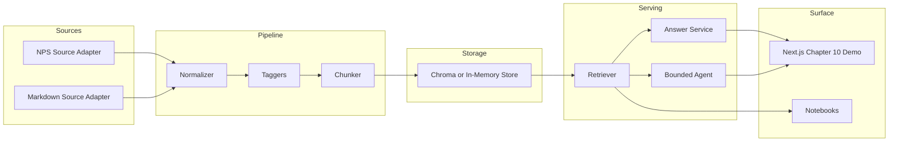

# Chapter 10 Retrieval Lab

This capstone turns the repo's earlier GenAI material into a working retrieval system. The emphasis is not "what is RAG?" but how an engineer assembles one without hiding the tradeoffs.

## What this adds

- A reusable ingestion contract built around `SourceAdapter.fetch()`
- A normalized `ContentItem` schema that keeps the pipeline dataset-agnostic
- Rule-based and model-assisted tagging with confidence and provenance
- Chunking, local embeddings, and metadata-aware retrieval
- A grounded answer service with citations, matched tags, and weak-evidence warnings
- A bounded agent that can search, inspect a source, and explain why content was tagged
- A dedicated frontend route in the existing Next.js app for query traces and audit panels

## Why NPS is here

National Park Service content is the worked example because it is public, structured, semantically rich, and still small enough for learners to understand without warehouse-scale infrastructure. The curriculum language stays generic: learners build against the interface, not the park domain.

## Quick start

### Run the API locally

```bash
cd chapter-10-rag-lab
python3 -m venv .venv
source .venv/bin/activate
pip install -e .[dev]
uvicorn main:app --reload --port 8001
```

### Optional live NPS refresh

Set `NPS_API_KEY` if you want to pull the worked example from the public API instead of the bundled seed files.

```bash
export NPS_API_KEY="your-key"
```

### Optional Ollama integration

The lab works without Ollama. If Ollama is available, the API will use it for embeddings and grounded answer synthesis.

```bash
ollama pull nomic-embed-text
ollama pull llama3.1:8b-instruct
```

### Run with Docker Compose

From the repo root:

```bash
docker compose up retrieval_lab_api nextjs
```

The API will be available at `http://localhost:8001`, and the demo surface at `http://localhost:3000/chapter-10`.

## Chapter map

| Chapter | Deliverable | Files |
|---|---|---|
| 10.0 | retrieval evaluation, hybrid search, reranking | `notebooks/10-retrieval-systems-and-agents/10.0 Retrieval Evaluation, Hybrid Search, and Reranking.ipynb` |
| 10.1 | system frame, contracts, glossary | `docs/system-memo.md`, `notebooks/10-retrieval-systems-and-agents/10.1 System Frame.ipynb` |
| 10.2 | source adapters and ingestion | `rag_lab/adapters.py`, `rag_lab/service.py` |
| 10.3 | normalization and tagging | `rag_lab/normalizer.py`, `rag_lab/tagging.py` |
| 10.4 | embeddings and vector store | `rag_lab/chunking.py`, `rag_lab/vectorstore.py` |
| 10.5 | grounded answers | `rag_lab/retrieval.py`, `rag_lab/answering.py` |
| 10.6 | bounded agent | `rag_lab/agent.py` |
| 10.7 | demo UI and evaluation | `react-app/pages/chapter-10.tsx`, `docs/exercises.md` |

## Architecture



## Supporting reading

- [System memo](docs/system-memo.md)
- [Exercise pack](docs/exercises.md)
- [Hosted stack appendix](docs/hosted-stack-appendix.md)

## Notes on modernization

The blueprint POC in the separate NPS repo helped shape the workflow but not the surface area. This capstone drops the older Create React App setup, keeps the API interface explicit, and treats agent behavior as an opt-in layer over retrieval rather than the starting point.
